<picture>
  <source media="(prefers-color-scheme: dark)" srcset="./dark.svg">
  <source media="(prefers-color-scheme: light)" srcset="./light.svg">
  
</picture>

 

<samp>&gt; SYSTEM ONLINE // DHRUV AGARWAL</samp>

  

  

<code>AI / ML</code> · <code>CLOUD</code> · <code>APP DEV</code> · <code>SYSTEMS</code> · <code>DESIGN</code>

  

&nbsp;

&nbsp;

 

 

01 // TECHNOLOGY MATRIX

  

<table width="100%">
<tr>

<td width="25%" align="center">

  

<code>LANGUAGES</code>

 

Python · Dart · Java  
JavaScript · TypeScript

</td>

<td width="25%" align="center">

  

<code>DEVELOPMENT</code>

 

Flutter · React  
Git · GitHub · VS Code

</td>

<td width="25%" align="center">

  

<code>AI / CLOUD</code>

 

AWS · OpenCV  
ML · Computer Vision · Cloud

</td>

<td width="25%" align="center">

  

<code>CREATIVE</code>

 

UI / UX · Figma  
Motion · Visual Design

</td>

</tr>
</table>

 

 

## SELECTED WORK

02 // SYSTEM ARCHIVE

  

<table width="100%">
<tr>

<td width="20%" align="center">

 

QA AUTOMATION

  

<code>PYTHON</code> · <code>AI</code>

 

Automated QA engineering.

  

<a href="https://github.com/dhruvagarwal4543/QA-Sentinel">REPO ↗</a>

</td>

<td width="20%" align="center">

 

VISION SYSTEM

  

<code>AWS</code> · <code>PYTHON</code>

 

Computer vision analytics.

  

<a href="https://github.com/dhruvagarwal4543/LENS-AI-Dashboard">REPO ↗</a>

</td>

<td width="20%" align="center">

 

COMPUTER VISION

  

<code>S3</code> · <code>REKOGNITION</code>

 

Face recognition pipeline.

  

<a href="https://github.com/dhruvagarwal4543/FaceTrack-">REPO ↗</a>

</td>

<td width="20%" align="center">

 

AVIATION APP

  

<code>FLUTTER</code> · <code>DART</code>

 

Airport companion.

  

<a href="https://github.com/dhruvagarwal4543/Skyport">REPO ↗</a>

</td>

<td width="20%" align="center">

 

APPLICATION

  

<code>UI</code> · <code>DATA</code>

 

Employee management.

  

<a href="https://github.com/dhruvagarwal4543/Employee-Management-App">REPO ↗</a>

</td>

</tr>
</table>

 

 

03 // BUILD STREAM

  

<table width="100%">
<tr>

<td width="33%" align="center">

<samp>01</samp>

 

<b>INKLY</b>

 

LOCAL-FIRST / NOTES

  

Handwriting-first workspace  
for tablet interaction.

</td>

<td width="33%" align="center">

<samp>02</samp>

 

<b>CMFS</b>

 

ACADEMIC / SYSTEMS

  

Course file management  
for academic workflows.

</td>

<td width="33%" align="center">

<samp>03</samp>

 

<b>DHRUV.OS</b>

 

DIGITAL / IDENTITY

  

Rebuilding my personal  
digital environment.

</td>

</tr>
</table>

 

 

## GITHUB TELEMETRY

 

 

## CONTRIBUTION SNAKE

04 // CONTRIBUTION TRACE

  

<picture>

  <source
    media="(prefers-color-scheme: dark)"
    srcset="https://raw.githubusercontent.com/dhruvagarwal4543/dhruvagarwal4543/output/github-contribution-grid-snake-dark.svg">

  <source
    media="(prefers-color-scheme: light)"
    srcset="https://raw.githubusercontent.com/dhruvagarwal4543/dhruvagarwal4543/output/github-contribution-grid-snake.svg">

  

</picture>

  

<code>ACTIVITY TRACE</code> · <code>KEEP BUILDING</code>

 

 

## NETWORK

 

<samp>BUILDING SOFTWARE · EXPLORING SYSTEMS · LEARNING IN PUBLIC</samp>

  

